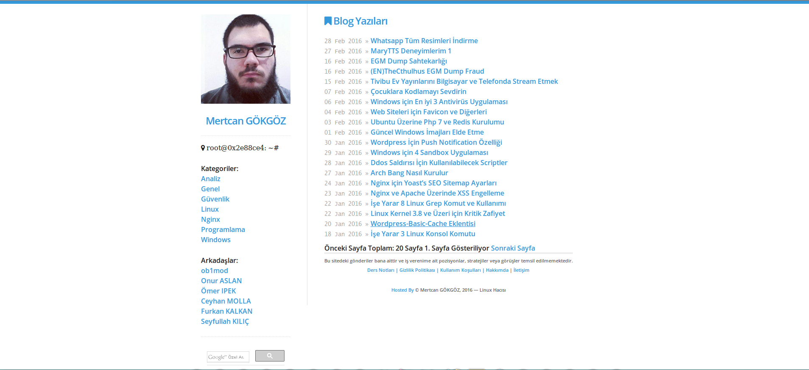

# mertcangokgoz.com

# Güncelleme 10 Şubat 2016

- Sayfalama yapısı eklendi
- Google Search eklendi
- Font Awesome 4.5.0 Güncellendi
- Yandex Metrica eklendi
- Sitemap eklendi
- RSS Feed eklendi
- SEO için ayarlamalar yapıldı(description,keyword,robots meta etc)
- Yerli yersiz jekyll kaynaklı hatalar düzeltildi
- Temada iyileştirmeler yapıldı(html tag,lang etc)

# Güncelleme 12 Şubat 2016

- Sabit Sayfalar için yorum özelliği kaldırıldı
- Resimlerin bazılarında bulunan gözükmeme sorunu kısmen giderildi
- Benzer yazılar özelliği geliştirildi
- Yazılar içerisinde bulunan kod hataları giderildi
- Skeleton CSS 2.0.4 Sürümüne yükseltildi
- Normalize CSS Eklendi
- Resimlere Responsive Özelliği Eklendi

# Güncelleme 13 Şubat 2016

- Kategorileme Eklendi
- SEO iyileştirmeleri yapıldı
- Yazılar güncellendi
- CSS Düzenlemeleri yapıldı
- OneSignal kullanılarak Push Notification özelliği eklendi

# Güncelleme 16 Şubat 2016

- Tüm yazıları tekrar düzenlendi
- Resim hataları tamamen giderildi
- Push Notification Özelliği Android Ve İOS için ayarlandı ve Default Mesaj eklendi

# Güncelleme 27 Şubat 2016

- Blog yazıları için MathJax Desteği Getirildi
 - Exp: [Math Blocks](http://kramdown.gettalong.org/syntax.html#math-blocks)
- Piwik ve Gauges Analitik Desteği Getirildi
- PageSpeed iyileştirmeleri yapıldı
- Github Pages desteği için güncelleme yapıldı
- Sosyal Medya Paylaşma Butonları Eklendi

# Güncelleme 5 Mart 2015

- Twitter card yapısı eklendi
- Sitemap için iyileştirilmeye gidildi
- 404 Sayfası yenilendi
- Yazı dizisi desteği getirildi
